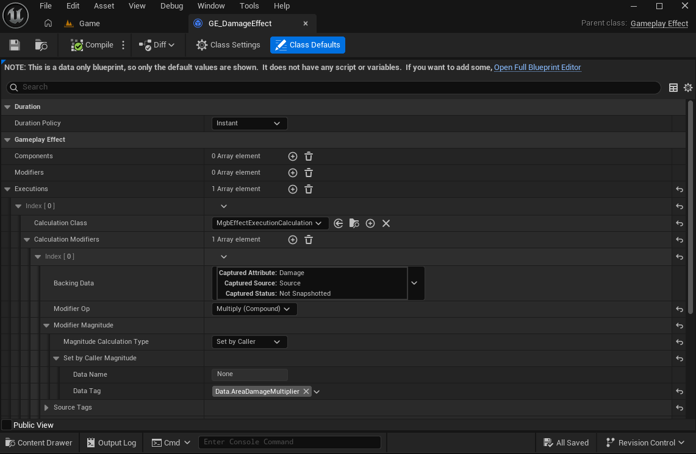

# Megabonky


### Gameplay Ability System (GAS) 기반 전투 시스템

**서버 타이머 기반 어빌리티 활성화: 플레이어가 폰을 소유하는 시점에 기본 무기를 자동으로 장착하고, `ActivateWeaponsAbility()`함수 호출로 장착된 모든 무기의 어빌리티를 서버단에서 타이머로 주기적으로 활성화합니다.**


```cpp
void AMgbPlayerController::OnPossess(APawn* aPawn)
{
  Super::OnPossess(aPawn);

  if (ULocalPlayer* LocalPlayer = Cast<ULocalPlayer>(GetLocalPlayer()))
  {
      if (UEnhancedInputLocalPlayerSubsystem* InputSubsystem = LocalPlayer->GetSubsystem<UEnhancedInputLocalPlayerSubsystem>())
      {
          InputSubsystem->AddMappingContext(InputMappingContext, 0);
      }
  }

  AMgbPlayerCharacter* PlayerCharacter = Cast<AMgbPlayerCharacter>(aPawn);
  if (PlayerCharacter)
  {
      PlayerCharacter->EquipWeapon(PlayerCharacter->DefaultWeaponClass);
      PlayerCharacter->ActivateWeaponsAbility();
  }
}
```

```cpp
void AMgbPlayerCharacter::ActivateWeaponsAbility()
{
  if (bDeath)
    return;

  float PlayerAttackSpeed = GetAbilitySystemComponent()->GetNumericAttribute(UPlayerAttributeSet::GetAttackSpeedAttribute());
  GetWorld()->GetTimerManager().SetTimer(ActivateAbilityHandle,
    [this]()
    {
      for (const auto& Weapon : Weapons)
      {
        Weapon->GetAbilitySystemComponent()->TryActivateAbilityByClass(Weapon->AbilityClass);
      }
    },
    2 / (PlayerAttackSpeed / 100),
    true,
    1.f);
}
```
<br><br>

**투사체 연속 발사: 무기와 플레이어 캐릭터의 투사체 개수 속성값을 합산한 후, 그 개수만큼 일정 간격으로 투사체를 스폰합니다.**


<details>
<summary>
Open Full Source Code
</summary>

```cpp
void UMgbGameplayAbility_Projectile::RapidFire()
{
	AActor* WeaponActor = GetCurrentActorInfo()->AvatarActor.Get(); // Avatar = Weapon Actor
	UAbilitySystemComponent* WeaponASC = GetAbilitySystemComponentFromActorInfo();

	AActor* PlayerActor = WeaponActor->GetOwner(); // PlayerActor
	UAbilitySystemComponent* PlayerASC = UAbilitySystemBlueprintLibrary::GetAbilitySystemComponent(PlayerActor);

	// Weapon ProjectileCount + Player ProjectileCount
	uint8 WeaponProjectileCount = WeaponASC->GetNumericAttribute(UWeaponAttributeSet::GetProjectileCountAttribute());
	uint8 PlayerProjectileCount = PlayerASC->GetNumericAttribute(UPlayerAttributeSet::GetProjectileCountAttribute());
	SpawnProjectileCount = WeaponProjectileCount + PlayerProjectileCount;

	// Weapon ProjectileBounce + Player ProjectileBounce
	uint8 WeaponProjectileBounce = WeaponASC->GetNumericAttribute(UWeaponAttributeSet::GetProjectileBouncesAttribute());
	uint8 PlayerProjectileBounce = PlayerASC->GetNumericAttribute(UPlayerAttributeSet::GetProjectileBouncesAttribute());
	ProjectileBounceCount = WeaponProjectileBounce + PlayerProjectileBounce;

	float SpawnInterval = float(1) / float(SpawnProjectileCount);

	GetWorld()->GetTimerManager().SetTimer(SpawnTimerHandle,
		[this, PlayerActor, WeaponActor]()
		{
			AActor* TargetActor = nullptr;

			AMgbPlayerCharacter* PlayerCharacter = Cast<AMgbPlayerCharacter>(PlayerActor);

			bool bFoundTarget = false;
			if (PlayerCharacter)
			{
				bFoundTarget = PlayerCharacter->FindPrimaryTargetByCondition(TargetActor);
			}

			if (bFoundTarget && TargetActor && Cast<AMgbEnemyCharacter>(TargetActor)->bSpawnFinished)
			{
				FRotator TargetRotation = UKismetMathLibrary::FindLookAtRotation(PlayerActor->GetActorLocation(), TargetActor->GetActorLocation());

				SpawnProjectile(WeaponActor, PlayerActor->GetActorLocation(), TargetRotation);
			}
			else
			{
				CurrentSpawnCount++;
			}

			if (CurrentSpawnCount >= SpawnProjectileCount)
			{
				CurrentSpawnCount = 0;
				GetWorld()->GetTimerManager().ClearTimer(SpawnTimerHandle);

				EndAbility(GetCurrentAbilitySpecHandle(), GetCurrentActorInfo(), GetCurrentActivationInfo(), false, false);
			}
		},
		SpawnInterval,
		true,
		0.f);
}
```
</details>

<br><br>

**Execution Calculation 활용한 데미지 계산: GameplayEffect적용으로 Attribute값을 조정하는데, Execution Calculation Class 를 활용해서 플레이어 캐릭터의 스탯과 무기 몬스터의 다양한 속성값을 참조해 데미지 계산을 했습니다.**



 Weapon Actor ASC를 Source로 ApplyGameplayEffectSpectToTarget() 함수 호출.
 Source(Weapon), Target(Enemy), Weapon의 Owner 액터는 무기를 소유한 PlayerCharacter로 설정.
 WeaponActor의 Attribute값은 Source로 부터 캡처해서 가져오고 PlayerCharacter의 Attribute 값은 Weapon의 Owner()로 접근해서 참조 했습니다.

```cpp
	
  float WeaponDamage = 0.f; 
	ExecutionParams.AttemptCalculateCapturedAttributeMagnitude(DamageDef, EvaluatedParams, WeaponDamage);
  ...

  AMgbPlayerCharacter* PlayerCharacter = Cast<AMgbPlayerCharacter>(Weapon->GetOwner());

  UAbilitySystemComponent* ASC = PlayerCharacter->GetAbilitySystemComponent();
  PlayerDamage = PlayerCharacter->GetAbilitySystemComponent()->GetNumericAttribute(UPlayerAttributeSet::GetDamageAttribute()) / 100;
  ...

```

<details>
<summary>
Open Full Source Code
</summary>

```cpp
void UMgbEffectExecutionCalculation::Execute_Implementation(const FGameplayEffectCustomExecutionParameters& ExecutionParams, FGameplayEffectCustomExecutionOutput& OutExecutionOutput) const
{	
	// SourceObj(Weapon)->Owner(Player)
	UObject* SourceObj = ExecutionParams.GetOwningSpec().GetEffectContext().GetSourceObject();
	AMgbWeapon* Weapon = Cast<AMgbWeapon>(SourceObj);
	AMgbPlayerCharacter* PlayerCharacter = Cast<AMgbPlayerCharacter>(Weapon->GetOwner());

	FAggregatorEvaluateParameters EvaluatedParams;
	EvaluatedParams.SourceTags = ExecutionParams.GetOwningSpec().CapturedSourceTags.GetAggregatedTags();
	EvaluatedParams.TargetTags = ExecutionParams.GetOwningSpec().CapturedTargetTags.GetAggregatedTags();

	// 캡쳐한 속성값들 가져오기
	float WeaponDamage = 0.f; 
	ExecutionParams.AttemptCalculateCapturedAttributeMagnitude(DamageDef, EvaluatedParams, WeaponDamage);

	float WeaponCritChance = 0.f; 
	ExecutionParams.AttemptCalculateCapturedAttributeMagnitude(CritChanceDef, EvaluatedParams, WeaponCritChance);

	float WeaponCritDamage = 0.f; 
	ExecutionParams.AttemptCalculateCapturedAttributeMagnitude(CritDamageDef, EvaluatedParams, WeaponCritDamage);

	// 무기로의 Owner인 플레이어 캐릭터의 어빌리티 시스템 컴포넌트에서 플레이어 속성값들 가져오기
	float PlayerDamage = 0.f; 
	UAbilitySystemComponent* ASC = PlayerCharacter->GetAbilitySystemComponent();
	PlayerDamage = PlayerCharacter->GetAbilitySystemComponent()->GetNumericAttribute(UPlayerAttributeSet::GetDamageAttribute()) / 100;

	float PlayerCritChance = 0.f; 
	PlayerCritChance = PlayerCharacter->GetAbilitySystemComponent()->GetNumericAttribute(UPlayerAttributeSet::GetCritChanceAttribute()) / 100;
	
	float PlayerCritDamage = 0.f; 
	PlayerCritDamage = PlayerCharacter->GetAbilitySystemComponent()->GetNumericAttribute(UPlayerAttributeSet::GetCritDamageAttribute()) / 100;

	float PlayerDamageToElite = 0.f;
	PlayerDamageToElite = PlayerCharacter->GetAbilitySystemComponent()->GetNumericAttribute(UPlayerAttributeSet::GetDamageToElitesAttribute()) / 100;

	bool bCrit = false;

	float CritChance = (WeaponCritChance + PlayerCritChance); 
	CritChance >= FMath::RandRange(0, 100) ? bCrit = true : bCrit = false;

	float TotalDamage = 0.f;
	if (bCrit)
	{
		TotalDamage = WeaponDamage * (1 + (WeaponCritDamage) / 100);
		TotalDamage = TotalDamage * PlayerCritDamage;
		TotalDamage = TotalDamage * PlayerDamage;
	}
	else
	{
		TotalDamage = WeaponDamage * PlayerDamage;
	}

	// 데미지를 입힌 무기 정보를 적에게 전달 (킬 어트리뷰션용)
	if (Weapon)
	{
		if (ExecutionParams.GetTargetAbilitySystemComponent() == nullptr)
			return;

		AActor* TargetActor = ExecutionParams.GetTargetAbilitySystemComponent()->GetAvatarActor();
		if (TargetActor == nullptr)
			return;

		if (AMgbEnemyCharacter* Enemy = Cast<AMgbEnemyCharacter>(TargetActor))
		{
			Enemy->SetLastDamageWeapon(Weapon);
		}
	}

	if (PlayerCharacter == nullptr)
		return;

	AMgbPlayerController* PC = Cast<AMgbPlayerController>(PlayerCharacter->GetOwner());
	if (PC)
	{
		if (!ExecutionParams.GetTargetAbilitySystemComponent())
			return;

		auto AvatarActor = ExecutionParams.GetTargetAbilitySystemComponent()->GetAvatarActor();
		if (!AvatarActor)
		{
			return;
		}

		FVector Location = AvatarActor->GetActorLocation();
		PC->ClientSpawnDamageTextActor(Location, TotalDamage, bCrit);
	}

	return OutExecutionOutput.AddOutputModifier(
		FGameplayModifierEvaluatedData(UEnemyAttributeSet::GetDamageTakenAttribute(), EGameplayModOp::Override, TotalDamage));
}
```
</details>

<br>

**Radial Damage 계산: 범위 데미지를 입히는 투사체일경우. 오버랩된 대상에게 GE_DamageEffect 적용시 최초 충돌위치에서 거리를 비교하여 Damage Falloff 값을 구한뒤, CalculationModifier를 통해서 캡쳐된 Damage Attribute 값에 SetByCaller로 Damage Falloff값을 곱해서 범위 데미지를 구현했습니다.**


```cpp
for (const auto& Actor : OutActors)
{
  if (!Actor)
    continue;

  // 무기의 Damage Attribute 값에 곱해줄 비율값 계산.
  float Length = (Actor->GetActorLocation() - GetActorLocation()).Length();
  float DistanceRatio = FMath::Clamp(1.f - (Length / Radius), 0.3f, 1.f);
  DistanceRatio = DistanceRatio;

  if (Weapon->DamageEffectClass)
  {
    FGameplayEffectSpecHandle EffectSpecHandle = Weapon->GetAbilitySystemComponent()->MakeOutgoingSpec(Weapon->DamageEffectClass, 1.f, EffectContextHandle);

    EffectSpecHandle.Data.Get()->SetSetByCallerMagnitude(TAG_Data_AreaDamageMultiplier, DistanceRatio);

    UAbilitySystemComponent* TargetASC = UAbilitySystemBlueprintLibrary::GetAbilitySystemComponent(Actor);
    Weapon->GetAbilitySystemComponent()->ApplyGameplayEffectSpecToTarget(*EffectSpecHandle.Data.Get(), TargetASC);
  }
}
```

<details>
<summary>
Open Full Source Code
</summary>

```cpp
void AMgbProjectileActor::HandleOverlap(AActor* OtherActor)
{
	// 서버에서만 충돌 검사.
	if (!HasAuthority())
	{
		return;
	}

	// GetOwner() = WeaponActor;
	AMgbEnemyCharacter* Enemy = Cast<AMgbEnemyCharacter>(OtherActor);
	if (Enemy)
	{
		ActorsToIgnore.Add(Enemy);

		// 단일 대상 데미지 계산
		AMgbWeapon* Weapon = Cast<AMgbWeapon>(GetOwner());
		if (Weapon)
		{
			FGameplayEffectContextHandle EffectContextHandle = Weapon->GetAbilitySystemComponent()->MakeEffectContext();
			EffectContextHandle.AddSourceObject(Weapon);
			EffectContextHandle.AddInstigator(Weapon, Weapon);

			if (Weapon->DamageEffectClass)
			{
				FGameplayEffectSpecHandle EffectSpecHandle = Weapon->GetAbilitySystemComponent()->MakeOutgoingSpec(Weapon->DamageEffectClass, 1.f, EffectContextHandle);

				EffectSpecHandle.Data.Get()->SetSetByCallerMagnitude(TAG_Data_AreaDamageMultiplier, 1.f);
				UAbilitySystemComponent* TargetASC = UAbilitySystemBlueprintLibrary::GetAbilitySystemComponent(OtherActor);
				Weapon->GetAbilitySystemComponent()->ApplyGameplayEffectSpecToTarget(*EffectSpecHandle.Data.Get(), TargetASC);

				if (bBounce && BounceCount > 0)
				{
					Bounce();
					return;
				}
			}

			// 광역 데미지 계산
			// 선형적으로 거리 데미지 감소(y = 1-x);
			if (bRadialDamage == true)
			{
				// Radius 내의 적들에게 데미지 적용.
				float Radius = CollisionComp->GetScaledSphereRadius() * 5;

				TArray<AActor*> OutActors;

	
				UKismetSystemLibrary::SphereOverlapActors(GetWorld(), GetActorLocation(), Radius,
					TArray<TEnumAsByte<EObjectTypeQuery>>(),
					AMgbEnemyCharacter::StaticClass(), 
					ActorsToIgnore,
					OutActors);

				for (const auto& Actor : OutActors)
				{
					if (!Actor)
						continue;

					// 무기의 Damage Attribute 값에 곱해줄 비율값 계산.
					float Length = (Actor->GetActorLocation() - GetActorLocation()).Length();
					float DistanceRatio = FMath::Clamp(1.f - (Length / Radius), 0.3f, 1.f);
					DistanceRatio = DistanceRatio;

					if (Weapon->DamageEffectClass)
					{
						FGameplayEffectSpecHandle EffectSpecHandle = Weapon->GetAbilitySystemComponent()->MakeOutgoingSpec(Weapon->DamageEffectClass, 1.f, EffectContextHandle);

						EffectSpecHandle.Data.Get()->SetSetByCallerMagnitude(TAG_Data_AreaDamageMultiplier, DistanceRatio);

						UAbilitySystemComponent* TargetASC = UAbilitySystemBlueprintLibrary::GetAbilitySystemComponent(Actor);
						Weapon->GetAbilitySystemComponent()->ApplyGameplayEffectSpecToTarget(*EffectSpecHandle.Data.Get(), TargetASC);
					}
				}
				Destroy();
				return;
			}
			Destroy();
			return;
		}
		else
		{
			Destroy();
			return;
		}
	}
	
	Destroy();
}
```
</details>

<br><br>

**무기 능력 업그레이드: 플레이어 레벨업시 서버측에서 업그레이드 정보를 생성하고, 클라이언트의 UI에 정보를 전달합니다. 클라이언트측 에서 UI클릭시 UI에 저장된 정보를 인자로 서버측으로 RPC 함수를 호출합니다. 서버측에선 모든 강화 수치가 0으로 설정된 GameplayEffect의 강화 수치를 인자로 받은 값으로 설정하고 플레이어에 적용합니다.**


```cpp
//레벨업시 서버측에서 업그레이드 정보를 생성하고, Client RPC로 클라이언트에서 UI를 업데이트 함수를 호출 합니다.
void AMgbGameStateBase::ServerAddXP_Implementation(float InValue)
{
	CurrentXP += InValue;
	float Percent = CurrentXP / RequiredXP;

	MulticastUpdateUI_XP(Percent);

	if (CurrentXP >= RequiredXP)
	{
		float temp = CurrentXP - RequiredXP;
		CurrentXP = 0;
		CurrentLevel++;
		RequiredXP = RequiredXP * (1.2f);

		ServerAddXP(temp);

		UGameplayStatics::SetGlobalTimeDilation(GetWorld(), 0.0001f);

		// 서버에서 각 플레이어마다 업그레이드 옵션을 생성하여 해당 클라이언트로 전송
		for (FConstPlayerControllerIterator Iterator = GetWorld()->GetPlayerControllerIterator(); Iterator; ++Iterator)
		{
			if (AMgbPlayerController* MgbPC = Cast<AMgbPlayerController>(Iterator->Get()))
			{
				TArray<FUpgradeSlotInfo> Slots = MgbPC->ServerGenerateUpgradeSlots();
				MgbPC->ClientShowUpgradeWindow(Slots);
			}
		}

		MulticastSetPauseGame(true);
	}
}

...

// 업그레이드 무기를 정할때 현재 플레이어가 가진 무기가 최대 소유가능 무기개수 4개를 넘지 않을경우, 무기 테이블에서 모든 무기를 업그레이드 후보선상에 올립니다.
// 후보선상에 오른 무기들을 섞어 앞에서부터 3개의 무기를 뽑고, 각 무기별 가능한 업그레이드 옵션도 1~2개 랜덤으로 뽑아서 무기의 강화 정보를 생성합니다.
TArray<FUpgradeSlotInfo> AMgbPlayerController::ServerGenerateUpgradeSlots()
{
	TArray<FUpgradeSlotInfo> Result;

	AMgbGameStateBase* GS = Cast<AMgbGameStateBase>(GetWorld()->GetGameState());
	AMgbPlayerCharacter* MgbPlayer = Cast<AMgbPlayerCharacter>(GetPawn());
	TArray<FName> WeaponNames;

	int WeaponCount = MgbPlayer->Weapons.Num();
	if (WeaponCount < 4)
	{
		WeaponNames = GS->DT_Weapon->GetRowNames();
	}
	else
	{
		for (int i = 0; i < 4; i++)
		{
			WeaponNames.Add(MgbPlayer->Weapons[i]->WeaponName);
		}
	}

	Algo::RandomShuffle(WeaponNames);

	for (int SlotNum = 0; SlotNum < 3; SlotNum++)
	{
		FName RandomWeaponName = WeaponNames[SlotNum];
		FMgbWeaponInfo* WeaponInfo = GS->DT_Weapon->FindRow<FMgbWeaponInfo>(RandomWeaponName, FString("Find Weapon"));
		if (!WeaponInfo)
		{
			return Result;
		}

		auto WeaponBonus = GS->DT_WeaponUpgradeBonus->FindRow<FMgbWeaponUpgradeBonus>(RandomWeaponName, FString("Find Bonus"));
		if (!WeaponBonus)
		{
			return Result;
		}

		auto Temp = WeaponBonus->UpgradeOptions;
		TArray<FWeaponUpgradeOption> SelectedOptions;
		Algo::RandomShuffle(Temp);

		int32 Count = FMath::RandRange(1, 2);
		for (int32 i = 0; i < Count && i < Temp.Num(); ++i)
		{
			SelectedOptions.Add(Temp[i]);
		}

		FUpgradeSlotInfo SlotInfo;
		SlotInfo.WeaponName = RandomWeaponName;
		SlotInfo.Options = SelectedOptions;
		Result.Add(SlotInfo);
	}

	return Result;
}

...

// 무기 업그레이드 관련 Struct, Enum
UENUM(BlueprintType)
enum class EWeaponUpgradeStat : uint8
{
	Damage,
	CritChance,
	CritDamage,
	ProjectileCount,
	ProjectileSpeed,
	ProjectileBounce,
	Size,
	Knockback,
	Duration
};

USTRUCT(BlueprintType)
struct FWeaponUpgradeOption
{
	GENERATED_BODY()

public:
	UPROPERTY(EditAnywhere, BlueprintReadOnly)
	EWeaponUpgradeStat StatType = EWeaponUpgradeStat::Damage;

	UPROPERTY(EditAnywhere, BlueprintReadOnly)
	float IncreaseValue = 0.f; // 증가 수치
};

USTRUCT(BlueprintType)
struct FUpgradeSlotInfo
{
	GENERATED_BODY()

public:
	UPROPERTY(BlueprintReadOnly)
	FName WeaponName;

	UPROPERTY(BlueprintReadOnly)
	TArray<FWeaponUpgradeOption> Options;
};

```

```cpp
// UI 위젯의 강화 슬롯 버튼을 클릭시 Server RPC 를 호출합니다.
void UItemSelectButton::HandleButtonClicked()
{
	APlayerController* PC = GetOwningPlayer();
	if (AMgbPlayerController* MgbPC = Cast<AMgbPlayerController>(PC))
	{
		MgbPC->ServerApplyWeaponUpgradeEffect(UpgradeItemName, Upgrades);
	}

	OnItemSelected.Broadcast();
}
```

```cpp
// 인자로 받은 UpgradeData를 바탕으로 강화 수치를 설정하고, 무기 능력치에 적용합니다.
void AMgbPlayerController::ServerApplyWeaponUpgradeEffect_Implementation(FName InWeaponName, const TArray<FWeaponUpgradeOption>& UpgradeData)
{
	AMgbPlayerCharacter* MgbPlayer = Cast<AMgbPlayerCharacter>(GetPawn());
	UAbilitySystemComponent* PlayerASC = UAbilitySystemBlueprintLibrary::GetAbilitySystemComponent(MgbPlayer);

	auto EquipedWeapons = MgbPlayer->Weapons;
	for (const auto& w : EquipedWeapons)
	{
		if (w->WeaponName == InWeaponName)
		{
			UAbilitySystemComponent* WeaponASC = w->GetAbilitySystemComponent();

			auto ContextHandle = WeaponASC->MakeEffectContext();
			auto SpecHandle = WeaponASC->MakeOutgoingSpec(GE_WeaponUpgradeDefaultClass, 1.f, ContextHandle);
			check(GE_WeaponUpgradeDefaultClass);
			auto EffectSpec = SpecHandle.Data.Get();

			EffectSpec->SetSetByCallerMagnitude(TAG_Attribute_Weapon_Damage, 0.f);
			EffectSpec->SetSetByCallerMagnitude(TAG_Attribute_Weapon_CritChance, 0.f);
			EffectSpec->SetSetByCallerMagnitude(TAG_Attribute_Weapon_CritDamage, 0.f);
			EffectSpec->SetSetByCallerMagnitude(TAG_Attribute_Weapon_ProjectileCount, 0.f);
			EffectSpec->SetSetByCallerMagnitude(TAG_Attribute_Weapon_ProjectileSpeed, 0.f);
			EffectSpec->SetSetByCallerMagnitude(TAG_Attribute_Weapon_ProjectileBounces, 0.f);
			EffectSpec->SetSetByCallerMagnitude(TAG_Attribute_Weapon_Size, 0.f);
			EffectSpec->SetSetByCallerMagnitude(TAG_Attribute_Weapon_Knockback, 0.f);
			EffectSpec->SetSetByCallerMagnitude(TAG_Attribute_Weapon_Duration, 0.f);

			for (const auto& u : UpgradeData)
			{
				switch (u.StatType)
				{
				case EWeaponUpgradeStat::Damage:
					EffectSpec->SetSetByCallerMagnitude(TAG_Attribute_Weapon_Damage, u.IncreaseValue);
					break;
				case EWeaponUpgradeStat::CritChance:
					EffectSpec->SetSetByCallerMagnitude(TAG_Attribute_Weapon_CritChance, u.IncreaseValue);
					break;
				case EWeaponUpgradeStat::CritDamage:
					EffectSpec->SetSetByCallerMagnitude(TAG_Attribute_Weapon_CritDamage, u.IncreaseValue);
					break;
				case EWeaponUpgradeStat::ProjectileCount:
					EffectSpec->SetSetByCallerMagnitude(TAG_Attribute_Weapon_ProjectileCount, u.IncreaseValue);
					break;
				case EWeaponUpgradeStat::ProjectileSpeed:
					EffectSpec->SetSetByCallerMagnitude(TAG_Attribute_Weapon_ProjectileSpeed, u.IncreaseValue);
					break;
				case EWeaponUpgradeStat::ProjectileBounce:
					EffectSpec->SetSetByCallerMagnitude(TAG_Attribute_Weapon_ProjectileBounces, u.IncreaseValue);
					break;
				case EWeaponUpgradeStat::Size:
					EffectSpec->SetSetByCallerMagnitude(TAG_Attribute_Weapon_Size, u.IncreaseValue);
					break;
				case EWeaponUpgradeStat::Knockback:
					EffectSpec->SetSetByCallerMagnitude(TAG_Attribute_Weapon_Knockback, u.IncreaseValue);
					break;
				case EWeaponUpgradeStat::Duration:
					EffectSpec->SetSetByCallerMagnitude(TAG_Attribute_Weapon_Duration, u.IncreaseValue);
					break;
				}
			}

			WeaponASC->ApplyGameplayEffectSpecToSelf(*EffectSpec);
			return;
		}
	}

	if (DT_Weapons)
	{
		auto WeaponInfo = DT_Weapons->FindRow<FMgbWeaponInfo>(InWeaponName, FString("Find Weapon"));

		TSubclassOf<AMgbWeapon> Weapon = WeaponInfo->WeaponClass;
		if (Weapon)
		{
			MgbPlayer->EquipWeapon(Weapon);
		}
	}
}
```

<br><br>

**네트워크 멀티플레이어 지원**
  - Server Authority 기반 설계
  - RPC를 통한 효율적인 네트워크 통신

### 네트워크 아키텍처
- **Server Authority**: 적 생성, 데미지 계산, XP/레벨 관리
- **Replication**: 모든 중요 속성 및 상태 동기화
- **RPC 활용**:
  - Server RPC: 클라이언트 → 서버 (XP 추가, 업그레이드 적용)
  - Client RPC: 서버 → 클라이언트 (데미지 텍스트)
  - Multicast RPC: 서버 → 모든 클라이언트 (UI 업데이트)